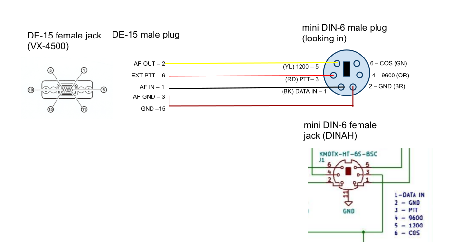

># An APRS digipeater running on a Raspberry Pi

<!-- toc -->

- [Hardware](#hardware)
  * [Cable pinout: VX-4500](#cable-pinout-vx-4500)
- [Software Dependencies](#software-dependencies)
- [Installation](#installation)
- [Appendix: Getting USB hotplug support to work](#appendix-getting-usb-hotplug-support-to-work)

<!-- tocstop -->

## Hardware

* [Raspberry PI 3B+](https://www.raspberrypi.com/products/raspberry-pi-3-model-b-plus/)
* [Canakit DCAR-052A5 5V 2.5A micro-USB power supply](https://www.canakit.com/raspberry-pi-adapter-power-supply-2-5a.html)
* [MakerFocus Raspberry Pi Case X002338M49](https://www.amazon.com/MakerFocus-Raspberry-Aluminum-Heatsink-Driver/dp/B07PNB7JWP)
* [SanDisk Ultra microSDXC UHS-I card 64 GB](https://www.amazon.com/SanDisk-microSDXC-Standard-Packaging-SDSQUNC-064G-GN6MA/dp/B010Q588D4)
* [DINAH CM119 USB soundmodem/PTT interface](https://kits4hams.com/dinah)
* [Vertex Standard VX-4500](https://www.yaesu.com/indexVS.cfm?cmd=DisplayProducts&ProdCatID=74&encProdID=985145DD4C41E33B7A105CE862474ED9&DivisionID=65&isArchived=0)
  * with [DE-15 to mini-DIN6 cable](#cable-pinout-vx-4500) (3-row high density DB-15)
* or Kenwood DM-710
  * with DINAH supplied mini-DIN6 male to male cable

### Cable pinout: VX-4500



## Software Dependencies

This code relies on a bunch of really old packages. I've cloned them
to make sure they don't dissappear as some of them have already been
dropped by Debian-hams and/or their upstream repos have gone missing.

* https://github.com/n2ygk/soundmodem Thomas Sailer's soundcard modem/PTT interface.
  * Requires a patch to support DINAH PTT
* https://github.com/n2ygk/aprx Matti Aarnio OH2MQK/Kenneth W. Finnegan W6KWF [digipeater](https://github.com/n2ygk/aprx)
  (Currently I only use it for APRS-IS igate functionality.)
* https://github.com/n2ygk/aprsdigi My AX.25 APRS RF digipeater.

Everything is configured based on callsign. See [install.sh](./install.sh).

## Installation
To configure and start the aprsdigi:
* Use Raspberry Pi Imager and select:
  * Raspberry Pi Device: No Filtering
  * OS: Raspberry Pi OS (other)/Raspberry Pi OS Lite (64-bit): Debian Bookworm with no desktop environment.
  * Select the CF media to write to.
  * Edit options:
    * General
      * hostname: a simple callsign-SSID
      * username/password
      * initial bootstrap WiFi LAN
    * Services
      * Enable SSH w/public-key authentication only
* Boot up with the CF just written and wait for one-time setup.
* ssh in just to make sure. If you can't get in via ssh, use the console and keyboard.
* Either tar up this directory and copy it to the Pi or use git to clone it:
```
$ ssh n2ygk@n2ygk.local
Linux n2ygk 6.1.0-rpi4-rpi-v8 #1 SMP PREEMPT Debian 1:6.1.54-1+rpt2 (2023-10-05) aarch64
...
Last login: Sun Nov 12 16:11:31 2023 from 192.168.1.154
n2ygk@n2ygk:~ $ sudo -s
root@n2ygk:/home/n2ygk# apt-get update
root@n2ygk:/home/n2ygk# apt-get upgrade -y
root@n2ygk:/home/n2ygk# apt autoremove -y
...
root@n2ygk:/home/n2ygk# apt-get install -y git
root@n2ygk:/home/n2ygk# exit
exit
n2ygk@n2ygk:~ $ mkdir src
n2ygk@n2ygk:~ $ cd src
n2ygk@n2ygk:~/src $ git clone https://github.com/n2ygk/aprspi.git
Cloning into 'aprspi'...
...
n2ygk@n2ygk:~/src $ cd aprspi
```

Copy the `fix-auth.sh` script which adds users:
```
aprspi$ scp fix-auth.sh n2ygk@n2ygk:src/aprspi/
```

Then pop back on the host and run the install script:
```
# get a copy of the .deb file from a prior build into ~/src
# or just let the installer patch and rebuild it from source:
n2ygk@n2ygk:~/src/aprspi $ sudo ./install.sh 
```
There will be lines of output with two prompts you have to respond to:
```
+ ufw enable
Command may disrupt existing ssh connections. Proceed with operation (y|n)? y
...
Please pop out and replug the DINAH usb device then hit enter: 
```

Don't logout yet!

After the installation script finishes, you will only be able to ssh in by having installed `~/.ssh/authorized_keys`.
Furthermore, you'll need to set up `google-authenticator` (answer 'y' to all the questions):
```
$ google-authenticator
```

Copy `~/.google_authenticator` and install in password store for later recovery.
```
scp n2ygk@n2ygk:.google_authenticator /tmp/t
pass edit comp/n2ygk/n2ygk
# copy in contents of /tmp/t
pass git push
```

## Appendix: Getting USB hotplug support to work

Depending on random boot order, the DINAH USB soundcard can show up in different slots.
To resolve this, add [95-myusb.rules](./95-myusb.rules) to /lib/udev/rules.d to symlink `/dev/snd/DINAH` to the appropriate ControlC* device:

```
# ls -l /dev/snd/
total 0
drwxr-xr-x 2 root root       60 Nov 14 12:22 by-id
drwxr-xr-x 2 root root      100 Nov 14 12:22 by-path
crw-rw---- 1 root audio 116,  0 Nov 13 17:40 controlC0
crw-rw---- 1 root audio 116, 32 Nov 13 17:40 controlC1
crw-rw---- 1 root audio 116, 64 Nov 14 12:22 controlC2
lrwxrwxrwx 1 root root        9 Nov 14 12:22 DINAH -> controlC2
crw-rw---- 1 root audio 116, 16 Nov 13 17:40 pcmC0D0p
crw-rw---- 1 root audio 116, 48 Nov 13 17:40 pcmC1D0p
crw-rw---- 1 root audio 116, 88 Nov 14 12:22 pcmC2D0c
crw-rw---- 1 root audio 116, 80 Nov 14 12:22 pcmC2D0p
crw-rw---- 1 root audio 116,  1 Nov 13 17:40 seq
crw-rw---- 1 root audio 116, 33 Nov 13 17:40 timer
```

You can then reference the DINAH in ALSA using the symlinked name:
```
$ alsactl info /dev/snd/DINAH 
#
# Sound card
#
- card: 2
  id: Device
  name: USB Audio Device
  longname: C-Media Electronics Inc. USB Audio Device at usb-3f980000.usb-1.2, full speed
  driver_name: USB-Audio
  mixer_name: USB Mixer
  components: USB0d8c:0012
  controls_count: 9
  pcm:
    - stream: PLAYBACK
      devices:
        - device: 0
          id: USB Audio
          name: USB Audio
          subdevices:
            - subdevice: 0
              name: subdevice #0
    - stream: CAPTURE
      devices:
        - device: 0
          id: USB Audio
          name: USB Audio
          subdevices:
            - subdevice: 0
              name: subdevice #0

```

And you can go straight to the card in alsamixer:
```
$ alsamixer -c /dev/snd/DINAH
```
or use `amixer` to set levels from the command line.

