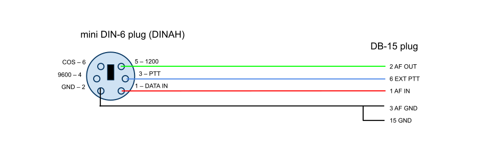

# An APRS digipeater running on a Raspberry Pi

<!-- toc -->

- [Hardware](#hardware)
  * [Cable pinout: VX-2500](#cable-pinout-vx-2500)
- [Software Dependencies](#software-dependencies)

<!-- tocstop -->

## Hardware

* [Raspberry PI 3B+](https://www.raspberrypi.com/products/raspberry-pi-3-model-b-plus/)
* [Canakit DCAR-052A5 5V 2.5A micro-USB power supply](https://www.canakit.com/raspberry-pi-adapter-power-supply-2-5a.html)
* [MakerFocus Raspberry Pi Case X002338M49](https://www.amazon.com/MakerFocus-Raspberry-Aluminum-Heatsink-Driver/dp/B07PNB7JWP)
* [SanDisk Ultra microSDXC UHS-I card 64 GB](https://www.amazon.com/SanDisk-microSDXC-Standard-Packaging-SDSQUNC-064G-GN6MA/dp/B010Q588D4)
* [DINAH CM119 USB soundmodem/PTT intercace](https://kits4hams.com/dinah)
* [Vertex Standard VX-4500](https://www.yaesu.com/indexVS.cfm?cmd=DisplayProducts&ProdCatID=74&encProdID=985145DD4C41E33B7A105CE862474ED9&DivisionID=65&isArchived=0)
  * with [DE-15 to mini-DIN6 cable](#cable-pinout-vx-2500) (3-row high density DB-15)
* or Kenwood DM-710
  * with DINAH supplied mini-DIN6 male to male cable

### Cable pinout: VX-2500

## Software Dependencies

This code relies on a bunch of really old packages. I've cloned them
to make sure they don't dissappear as some of them have already been
dropped by Debian-hams and/or their upstream repos have gone missing.

* https://github.com/n2ygk/soundmodem Thomas Sailer's soundcard modem/PTT interface.
  * Requires a patch to support DINAH PTT
* https://github.com/n2ygk/aprsd Dale Heatherington WA4DSY AX.25 APRS-IS gateway.
* https://github.com/n2ygk/aprsdigi My AX.25 APRS RF digipeater.

